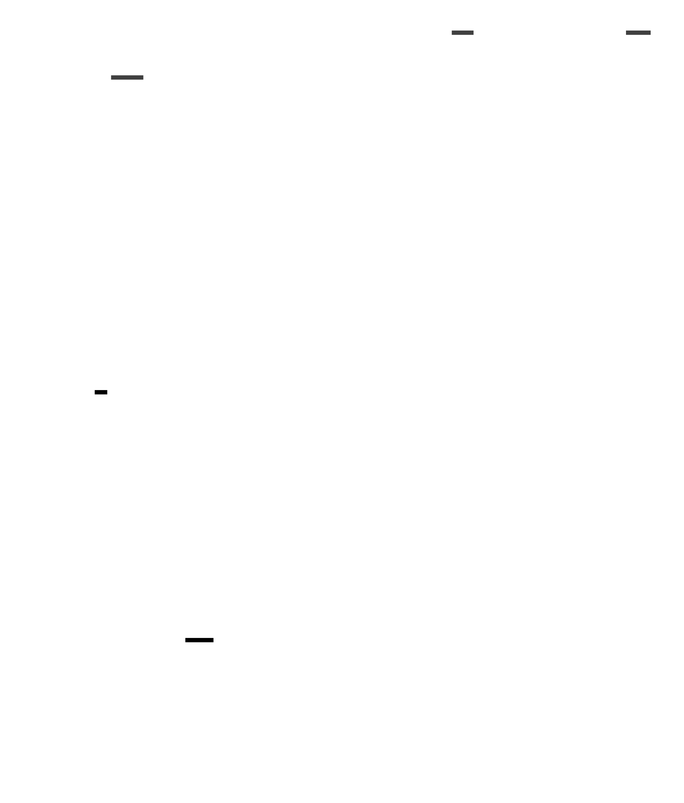

# Misc docs

The VRChat API is a bit of a mess.
This folder is mainly for documenting it to help in creating the proper rust models for it.
Note that these might not be kept up to date, check the commit dates & prefer reading the code instead.

For other community resources on the API, see the [vrchatapi project](https://vrchatapi.github.io/docs/api/).

## User information

